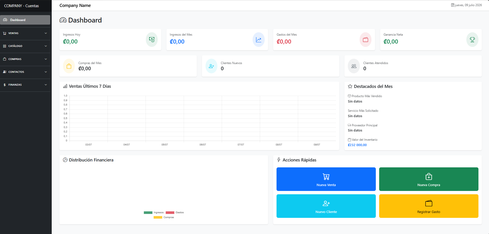
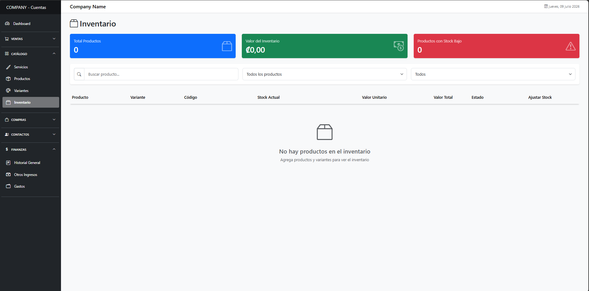
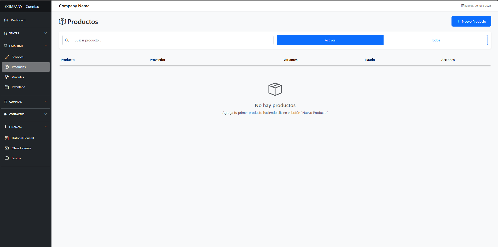
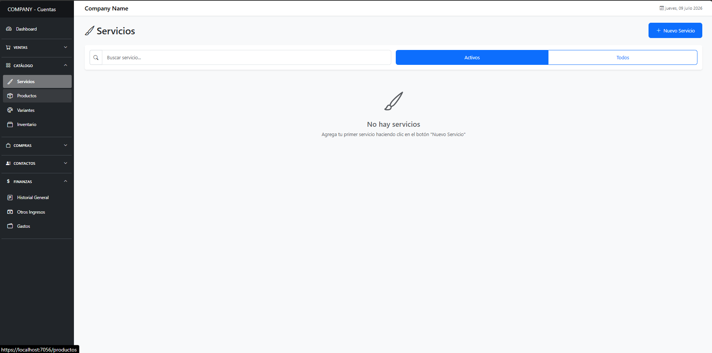
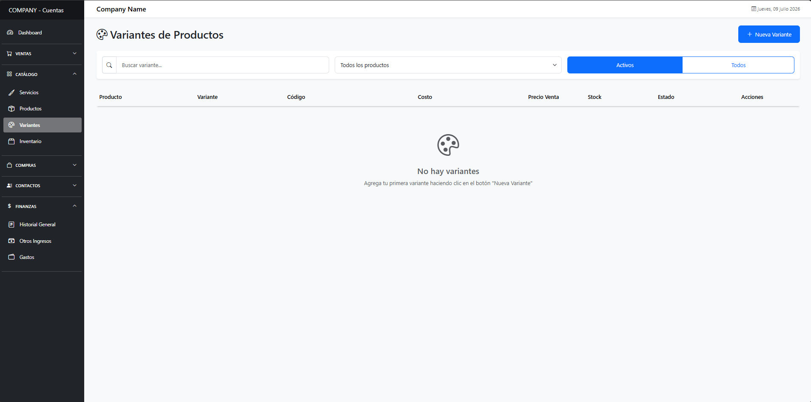
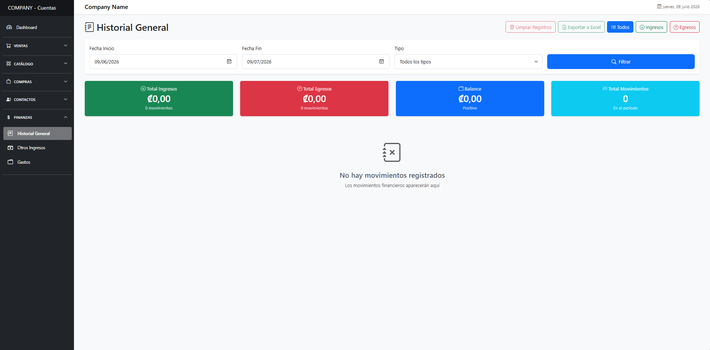

# ERP - Adaptable 

ERP_Software es un sistema de planificación integral (ERP) moderno e intuitivo, diseñado específicamente para optimizar y gestionar la administración empresarial. Desarrollado con la flexibilidad y potencia de **.NET 9** y **Blazor**, este sistema provee las herramientas necesarias para digitalizar por completo las operaciones del negocio.

## 🚀 Características Principales

*   **Punto de Venta (POS):** Registro rápido e intuitivo de transacciones por venta de productos y prestación de servicios.
*   **Ventas y Facturación:** Gestión de órdenes, aplicación de descuentos e historial de ventas detallado (`Sale`, `SaleItem`).
*   **Gestión de Inventario y Catálogo:** Control especializado de stock, registro de productos (`Product`) con soporte para múltiples variantes, tamaños o colores (`ProductVariant`).
*   **Servicios Empresariales:** Definición de un catálogo de servicios (`Service`) configurables con precios e información relevante.
*   **Relación con Clientes (CRM Básico):** Ficha de clientes (`Customer`), seguimiento de preferencias y fidelización.
*   **Compras y Proveedores:** Mapeo de ingresos de mercancía (`Purchase`, `PurchaseItem`) y cartera de proveedores (`Supplier`).
*   **Control Financiero:** Libro diario de caja, con módulo dedicado para registro de ingresos (`Income`) y egresos u honorarios (`Expense`).

## 📸 Capturas de Pantalla del Sistema

### Dashboard / Panel Principal

*Visualización global de ingresos, gastos y rendimiento general del negocio en el día.*

### Punto de Venta (POS)

*Interfaz de facturación fácil de usar.*

### Gestión de Inventario

*Catálogo de productos y seguimiento en tiempo real del stock.*

### Módulo Financiero

*Registro y balance de ingresos y gastos operativos de la empresa.*

## 🏗️ Arquitectura del Sistema

El desarrollo de este sistema está fuertemente guiado por los principios de **Clean Architecture** (Arquitectura Limpia). Esto garantiza un software modular, testeable, mantenible y verdaderamente escalable.

El flujo de dependencias sigue la regla de apuntar siempre hacia el centro (el núcleo del negocio), evitando que cambios tecnológicos afecten la lógica empresarial.

La estructuración se divide de la siguiente manera:

1.  **Capa de Dominio (`Domain`):**
    *   **Núcleo Empresarial:** Contiene las entidades principales sin ninguna dependencia de librerías externas o tecnológicas (`Customer`, `Product`, `Service`, `Sale`, etc.).
    *   **Reglas Base:** Aquí se asientan enumeradores (`Enums`) y lógica intrínseca a los actores del negocio.

2.  **Capa de Aplicación (`Application`):**
    *   **Casos de Uso:** Orquesta las reglas de negocio de la aplicación (Ej: un proceso completo de venta).
    *   **Servicios y Contratos:** Posee la carpeta `Interfaces` que define los contratos (abstracciones) para repositorios que las capas exteriores deberán implementar.
    *   **Transferencia de Datos:** Contiene todos los `DTOs` (Data Transfer Objects) y `Services` operando como puente.

3.  **Capa de Infraestructura (`Infrastructure`):**
    *   **Persistencia de datos:** Contiene el módulo `Data` y los `Repositories` reales. 
    *   Implementa estrictamente los contratos definidos por la capa de Aplicación. Su objetivo exclusivo es interactuar con agentes externos.

4.  **Capa de Presentación / UI (`Components` & `wwwroot`):**
    *   Desarrollada integralmente en **Blazor** (.NET 9).
    *   Contiene la maquetación web, estilos, diseño responsivo y la inyección de dependencias necesarias.
    *   Recibe la interacción del usuario final e invoca los métodos correspondientes expuestos por la capa de Aplicación.

## 🛠️ Stack Tecnológico

*   **Framework Base:** .NET 9
*   **Arquitectura de UI:** Blazor (Componentes Web interactivos mediante C#)
*   **Aproximación Estructural:** Clean Architecture + Repository Pattern
*   **Contenedores:** Docker (Aplicación empaquetada lista para entornos nativos en la nube, con configuración en `Dockerfile`)

---

*Creado y diseñado para organizar y optimizar tareas diarias de administración en el entorno empresarial.*
